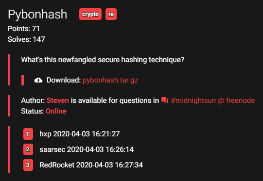
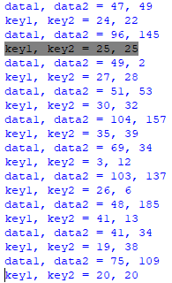

Midnightsun CTF 2020
********************

Giải này có 4 bài crypto thì mình làm ra một bài pyBonHash, còn bài rsayay là tham khảo trên mạng. Sau đây là writeup của mình.

pyBonHash
=========



	Description

Download `pybonhash.tar.gz <pybonhash.tar.gz>`_.

Đề cho mình file ``hash.txt`` (là ciphertext) và ``pybonhash.cpython-36.pyc``. File pyc là file python đã compile nên mình không thể đọc được. 

Trên mạng có khá nhiều trang decompiler file pyc, chẳng hạn mình dùng trang `<https://www.toolnb.com/tools-lang-en/pyc.html>`_. Decompile file pyc của đề mình được file python với nội dung như sau:

.. code-block:: python

   # uncompyle6 version 3.5.0
   # Python bytecode 3.6 (3379)
   # Decompiled from: Python 2.7.5 (default, Aug  7 2019, 00:51:29) 
   # [GCC 4.8.5 20150623 (Red Hat 4.8.5-39)]
   # Embedded file name: pybonhash.py
   # Compiled at: 2020-03-28 21:11:38
   # Size of source mod 2**32: 1017 bytes
   import string, sys, hashlib, binascii
   from Crypto.Cipher import AES
   from flag import key
   if not len(key) == 42:
      raise AssertionError
   data = open(sys.argv[1], 'rb').read()
   if not len(data) >= 191:
      raise AssertionError
   FIBOFFSET = 4919
   MAXFIBSIZE = len(key) + len(data) + FIBOFFSET

   def fibseq(n):
      out = [0, 1]
      for i in range(2, n):
         out += [out[(i - 1)] + out[(i - 2)]]

      return out


   FIB = fibseq(MAXFIBSIZE)
   i = 0
   output = ''
   while i < len(data):
      data1 = data[(FIB[i] % len(data))]
      key1 = key[((i + FIB[(FIBOFFSET + i)]) % len(key))]
      i += 1
      data2 = data[(FIB[i] % len(data))]
      key2 = key[((i + FIB[(FIBOFFSET + i)]) % len(key))]
      i += 1
      tohash = bytes([data1, data2])
      toencrypt = hashlib.md5(tohash).hexdigest()
      thiskey = bytes([key1, key2]) * 16
      cipher = AES.new(thiskey, AES.MODE_ECB)
      enc = cipher.encrypt(toencrypt)
      output += binascii.hexlify(enc).decode('ascii')

   print(output)

Độ dài của key là :math:`42`, và độ dài data phải lớn hơn hoặc bằng :math:`191`. Hàm ``fibseq`` không khó nhận ra mục đích là tạo dãy số Fibonacci.

``FIB`` là dãy số Fibonacci tới số hạng thứ ``MAXFIBSIZE``. Giờ tới phần mã hóa. Khởi gán ``i = 0``. Trong mỗi lặp mình có:

- ``data1``: lấy data ở vị trí ``FIB[i] % len(data)``;
- ``key1``: lấy key ở vị trí ``(i + FIB[FIBOFFSET + i]) % len(key)``;
- tăng ``i`` lên :math:`1`;
- ``data2`` và ``key2`` tính giống ``data1`` và ``key1``;
- tăng ``i`` lên :math:`1`;
- ``toencrypt`` là mã hash md5 của ``bytes([data1, data2])``;
- ``thiskey`` là key tạo ra từ ``bytes([key1, key2])`` lặp lại :math:`16` lần;
- sau khi ``toencrypt`` được mã hóa bởi AES ở ECB, dùng khóa là ``thiskey``, ciphertext được lưu vào ``enc``;
- ``output`` ghép vào sau ciphertext đã được chuyển thành dạng hexa.

**Ngừng đọc và suy nghĩ**: khá là lung tung và có vẻ như việc phá AES là bất khả thi!!! Đúng không nhỉ? :))))

Ở đây, ``len(key) = 42`` là cố định, và mình để ý thấy mỗi lần lặp cần hai vị trí trong data nên chắc chắn ``len(data) = 192``.

Đầu tiên, cách lấy index của ``data1``, ``key1`` (``data2`` và ``key2`` tương tự) làm mình thấy rất "hoang mang", không biết có tính chất gì không nhỉ? Thử code một đoạn lấy index xem sao.

.. code-block:: python

   def fibseq(n):
      out = [0, 1]
      for i in range(2, n):
         out += [out[(i - 1)] + out[(i - 2)]]

      return out

   FIB = fibseq(4919 + 42 + 192)
   i = 0
   while i < 192:
      data1 = FIB[i] % 192
      key1 = (i + FIB[4919 + i]) % 42
      i += 1
      data2 = FIB[i] % 192
      key2 = (i + FIB[4919 + i]) % 42
      i += 1
      print("data1, data2 = {0}, {1}".format(data1, data2))
      print("key1, key2 = {0}, {1}".format(key1, key2))

Mình để ý thấy một số vị trí khá thú vị như dưới đây:



Index của ``key1`` và ``key2`` trùng nhau. Vì vậy, thay vì phải giải mã từ AES rồi crack ngược md5 sao ta không ... bruteforce nó luôn nhỉ? Đó chính là ý tưởng của mình.

Mình sẽ bắt đầu từ những vị trí mà index của ``key1`` bằng index ``key2``.

Mình có index ``data1`` và ``data2`` rồi (code ở trên) thì mình chỉ cần bruteforce xem giá trị ở ``data1`` và ``data2`` là gì, và với ``key_s`` nào sẽ cho ra ciphertext khớp với đề cho.

Khi tìm được ``key_s`` thì mình lưu lại giá trị vào đúng index đó trong key ban đầu.

Tiếp theo, khi mình bắt gặp vị trí mà index ``key1`` khác index ``key2``, nếu mình đã giải ra ``key1`` hoặc ``key2`` thì mình làm động tác bruteforce tương tự cho key còn lại chưa giải ra.

Sau đây là hàm bruteforce:

.. code-block:: python

   def find_match(ciphertext, knownkey = 65, hasother = 0): 
      # hasother = 0 when it doens't have other
      # hasother = 1 when knownkey is behind key
      # hasother = -1 when knowkey is before key
      for data1 in range(128):
         for data2 in range(128):
            tohash = bytes([data1, data2])
            toencrypt = hashlib.md5(tohash).hexdigest().encode()
            for key in range(32, 128):
               if hasother == 1:
                  thiskey = bytes([key, knownkey]) * 16
               elif hasother == -1:
                  thiskey = bytes([knownkey, key]) * 16
               else:
                  thiskey = bytes([key, key]) * 16
               cipher = AES.new(thiskey, AES.MODE_ECB)
               enc = cipher.encrypt(toencrypt)
               # print(binascii.hexlify(enc), text)
               if ciphertext == binascii.hexlify(enc):
                  print("\t\tFound data1, data2, key = {0}, {1}, {2}".format(data1, data2, key))
                  return (data1, data2, key)

**Note**: khi giải mình vét từ :math:`0` tới :math:`256` rất lâu nhưng khi đã giải xong thì mình mới phát hiện key và data đều là ký tự in được nên ở đây mình đưa code chạy "ít trâu bò" hơn.

Hàm này mình nhận tham số là ciphertext (lấy từ file ``hash.txt``), ``knownkey`` trong trường hợp có hai key khác nhau (default là :math:`65`) và ``hasother`` nếu có hai key (default bằng :math:`0` khi hai key giống nhau).

Mình encrypt y như đề bài và so sánh kết quả với ciphertext, nếu đúng thì trả về ``data1``, ``data2`` và ``key``.

Mình cần lưu lại index của ``data1``, ``data2`` và ``key`` để lưu kết quả của hàm ``find_match`` về đúng vị trí của nó. 

Mình tận dụng hàm mình code ở trước và tạo một số mảng để lưu index lẫn kết quả:

.. code-block:: python

   plaintext = [-1] * 192
   keyfound = [-1] * 42
   keyindex = []
   dataindex = []

   FIB = fibseq(MAXFIBSIZE)
   i = 0
   while i < 192:
      data1_idx = FIB[i] % 192
      key1_idx = (i + FIB[FIBOFFSET + i]) % 42
      i += 1
      data2_idx = FIB[i] % 192
      key2_idx = (i + FIB[FIBOFFSET + i]) % 42
      i += 1
      keyindex.append((key1_idx, key2_idx))
      dataindex.append((data1_idx, data2_idx))

Xử lý nào!

.. code-block:: python

   while -1 in keyfound:
      for k in range(len(keyindex)):
         print(keyindex[k])
         if keyindex[k][0] == keyindex[k][1]:
            if keyfound[keyindex[k][0]] != -1: continue
            plaintext[dataindex[k][0]], plaintext[dataindex[k][1]], keyfound[keyindex[k][0]] = find_match(data[k * 64: (k + 1) * 64])
         else:
            if keyfound[keyindex[k][0]] != -1 and keyfound[keyindex[k][1]] == -1:
               plaintext[dataindex[k][0]], plaintext[dataindex[k][1]], keyfound[keyindex[k][1]] = find_match(data[k * 64: (k + 1) * 64], keyfound[keyindex[k][0]], -1)
            elif keyfound[keyindex[k][0]] == -1 and keyfound[keyindex[k][1]] != -1:
               plaintext[dataindex[k][0]], plaintext[dataindex[k][1]], keyfound[keyindex[k][0]] = find_match(data[k * 64: (k + 1) * 64], keyfound[keyindex[k][1]], 1)
            else: continue
         print(plaintext, keyfound, dataindex[k])

Việc chạy mất thời gian khá lâu, và flag chính là key.

**Note**: trong quá trình chạy các bạn sẽ thấy plaintext đôi khi không khớp, ví dụ ``plaintext[2]`` sẽ có nhiều giá trị. Đó là do mã hash md5 bị đụng độ, key sẽ không thay đổi.

Key tìm được sẽ là

```
[109, 105, 100, 110, 105, 103, 104, 116, 123, 120, 119, 74, 106, 80, 119, 52, 86, 112, 48, 90, 108, 49, 57, 120, 73, 100, 97, 78, 117, 122, 54, 122, 84, 101, 77, 81, 49, 119, 108, 78, 80, 125]
```

.. Flag: midnight{xwJjPw4Vp0Zl19xIdaNuz6zTeMQ1wlNP}

rsa_yay
=======

.. code-block:: python

    while True:
        p = random_prime(2**512)
        q = ZZ(int(hex(p)[::-1], 16))
        if q.is_prime():
            break

    # hex(p*q)
    # '7ef80c5df74e6fecf7031e1f00fbbb74c16dfebe9f6ecd29091d51cac41e30465777f5e3f1f291ea82256a72276db682b539e463a6d9111cf6e2f61e50a9280ca506a0803d2a911914a385ac6079b7c6ec58d6c19248c894e67faddf96a8b88b365f16e7cc4bc6e2b4389fa7555706ab4119199ec20e9928f75393c5dc386c65'
    # hex(ciphertext)
    # '3ea5b2827eaabaec8e6e1d62c6bb3338f537e36d5fd94e5258577e3a729e071aa745195c9c3e88cb8b46d29614cb83414ac7bf59574e55c280276ba1645fdcabb7839cdac4d352c5d2637d3a46b5ee3c0dec7d0402404aa13525719292f65a451452328ccbd8a0b3412ab738191c1f3118206b36692b980abe092486edc38488'

Nếu biết :math:`k` bit cao nhất của :math:`p` và :math:`q`, gọi là :math:`ph` và :math:`qh` thì ta có chặn

.. math:: ph \cdot qh \cdot 2^{1024-2k} \leqslant n < (ph+1) \cdot (qh + 1) \cdot 2^{1024-2k}.

Khi đó, ta brute :math:`12` bit thấp nhất của :math:`p` và tính nghịch đảo của từng trường hợp trong modulo :math:`2^{12}`. Nghịch đảo này chính là :math:`12` bit thấp nhất của :math:`q` và suy ra được :math:`12` bit cao nhất của :math:`p` và :math:`q`.

.. code-block:: python

    from gmpy2 import *
    import binascii

    n = 0x7ef80c5df74e6fecf7031e1f00fbbb74c16dfebe9f6ecd29091d51cac41e30465777f5e3f1f291ea82256a72276db682b539e463a6d9111cf6e2f61e50a9280ca506a0803d2a911914a385ac6079b7c6ec58d6c19248c894e67faddf96a8b88b365f16e7cc4bc6e2b4389fa7555706ab4119199ec20e9928f75393c5dc386c65
    cipher = 0x3ea5b2827eaabaec8e6e1d62c6bb3338f537e36d5fd94e5258577e3a729e071aa745195c9c3e88cb8b46d29614cb83414ac7bf59574e55c280276ba1645fdcabb7839cdac4d352c5d2637d3a46b5ee3c0dec7d0402404aa13525719292f65a451452328ccbd8a0b3412ab738191c1f3118206b36692b980abe092486edc38488

    def reverse_hex(x,n):
        y = 0
        for i in range(n):
            y = y*16 + x % 16
            x //= 16
        return y

    cur = []

    # Find all cases for lowest 12 bits
    for i in range(1, 4096, 2): # i is lowest 12 bits of p
        t = pow(i, -1, 4096) * (n % 4096) % 4096 # t is lowest 12 bits of q
        assert t * i % 4096 == n % 4096
        t2 = reverse_hex(t,3) # t2 is highest 12 bits of q
        i2 = reverse_hex(i,3) # i2 is highest 12 bits of p
        l = i2 * t2 << (4 * 125 * 2)
        r = (i2 + 1) * (t2 + 1) << (4 * 125 * 2)
        if l <= n <= r: # check where n is in the range
            cur.append(i)

    # Current digit (in hex)
    for c in range(4, 65):
        nc = []
        mod = 16**c
        for x in cur:
            for y in range(16):
                i = x + y * 16**(c-1) # i is lowest 4c bits of p
                t = pow(i, -1, mod) * (n % mod) % mod # t is lowest 4c bits of q
                assert t*i%mod==n%mod
                t2 = reverse_hex(t, c) # t2 is highest 4c bits of q
                i2 = reverse_hex(i, c) # i2 is highest 4c bits of p
                l = i2 * t2 << (4 * (128 - c) * 2)
                r = (i2 + 1) * (t2 + 1) << (4 * (128 - c) * 2)
                if l <= n <= r: # check where n is in the range
                    nc.append(i)
        cur=nc

    # Find real solution
    c = 64
    mod = 16**c
    for i in cur:
        t = pow(i, -1, mod) * (n % mod) % mod
        assert t * i % mod == n % mod
        t2 = reverse_hex(t, c)
        i2 = reverse_hex(i, c)
        p = t2 << 256 | i
        q = i2 << 256 | t
        if p * q == n:
            break

    e = 65537
    d = pow(e, -1, (p - 1) * (q - 1))
    o = pow(cipher, d, p*q)
    print(binascii.unhexlify(hex(o)[2:]))

    # b'midnight{d1vid3_and_c0nqu3r}x/\xda\xc9\xc4y\xb4\xc5!\x14\xc4p\xfal<a\x00\xd9m\xae\xb0k\xf8\xe0\xb31\xd9\xe6J\xcd\xaf|\x0b\xde6\xe2\xe8|>\xb8\xa2\x03\xa6\x92\xf6\xf3i\x10\xbb\x04\xc4Ha\x83d\x9d}6S\x88K\xba\tp\xed\xa3\xe2\xaf3\xc9\xae\xa9\xafF\xe5\x0c?\xae\x99\xae\x12\xb1\x9fO\xd2\xbc\x86\xedi\xab\xfc\xe7I\x82\xba\xfee\xba\xf0\xed'
